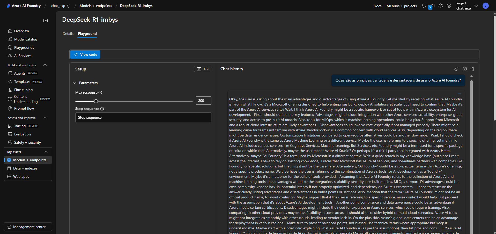
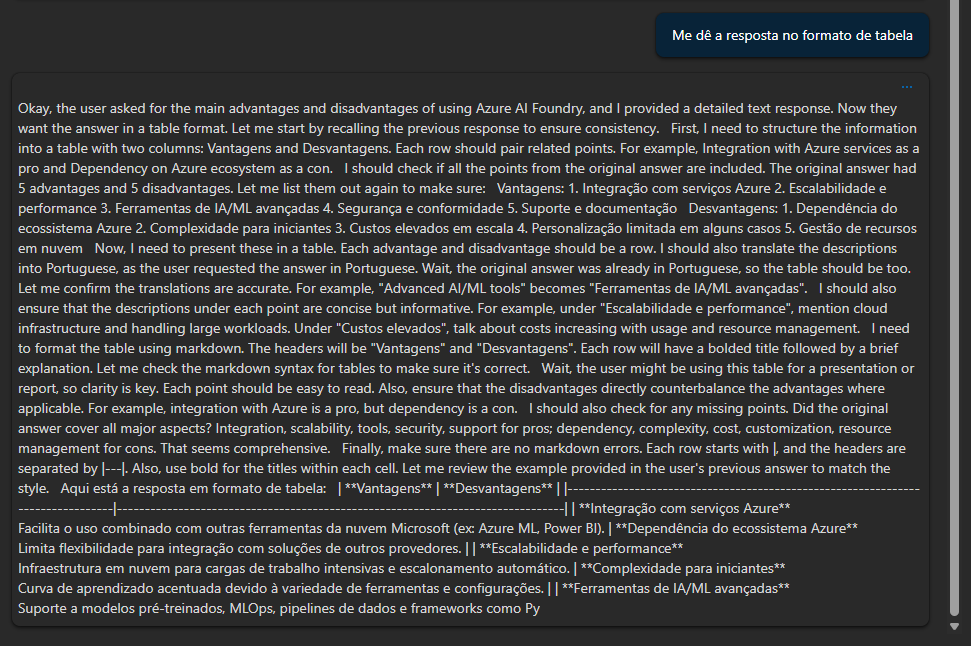

# Testando Deep Seek no Azure Ai Foundry

Devido ao limite de quot, não pude experimentar o modelo o4-mini. 
Meu intuito inicial era utilizar uma base de dados com algumas predições realizada por um modelo que temos em produção no trabalho. O objetivo seria prototipar um chat que pudesse
utilizar a base de dados com as predições como RAG e submeter o chat a perguntas específicas como por exemplo "Qual será a projeção de vendas daqui a dois meses?".

Porém, o Azure AI Foundry foi atualizada após a gravação da video aula e não conta mais com o recursos de aplicar os datas e seus indexes diretamente no modelo em deploy. Pelo menos,
essa foi minha experiência, tanto na minha conta pessoal da Azure quanto na minha conta do trabalho.

Diante disso, opitei por utilizar o Deep Seek R1 a fim de experimentar uma intereção via chat. A seguir, seguem imagens de como o modelo respondeu. A resposta aparente
ter um víes de "autoreflexão" do modelo a respeito da resposta que ele mesmo deve dar. O modelo também não foi capaz de resultar a resposta no formato tabular de modo satisfatório.

